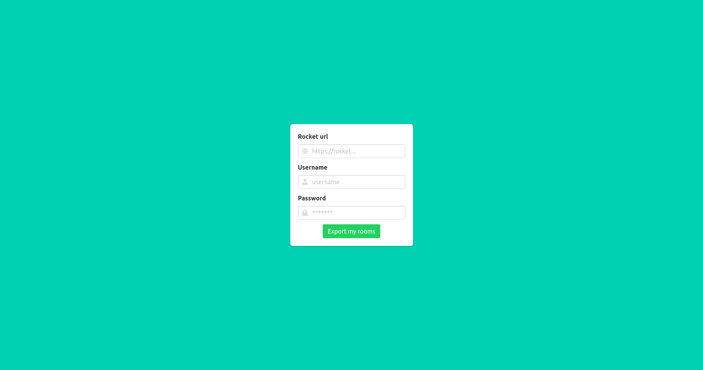

# Rocket HTML

This Lumen based application can export Rocket.chat channels, groups and ims into separated html files.  
It has a simple export page, where you can define your rocket chat url and the username-password pair.  
It creates separated folders for the channels/groups/ims, creates html files and downloads the attachments.

## Screenshot



## Install

Clone the repository
```
git clone https://github.com/terzinnorbert/rocket-html.git
```
Install php packages
```
composer install
```

## Run
Start web server
```
php -S localhost:8080 -t ./public
```